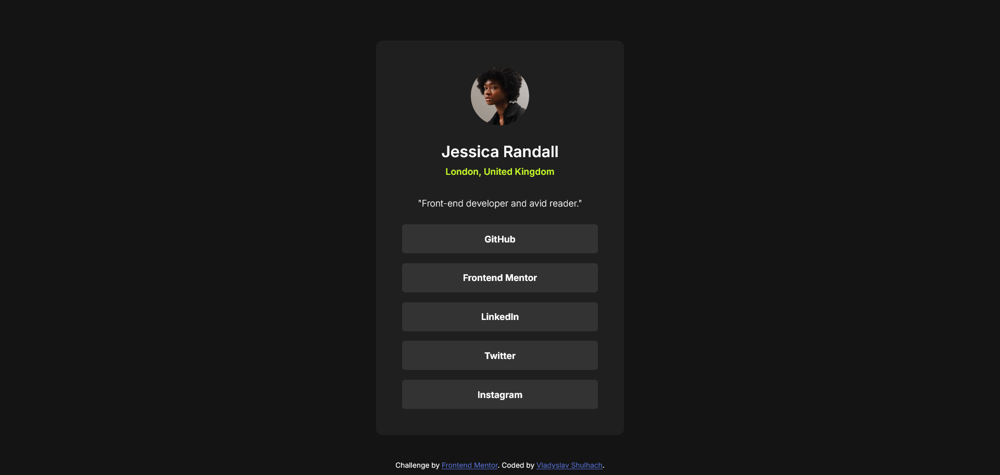

# Frontend Mentor - Social links profile solution

This project is a solution to the [Social links profile challenge on Frontend Mentor](https://www.frontendmentor.io/challenges/social-links-profile-UG32l9m6dQ). These challenges are designed to enhance coding skills through building practical, real-world projects.

## Table of contents

- [Overview](#overview)
  - [The challenge](#the-challenge)
  - [Screenshot](#screenshot)
  - [Links](#links)
- [My process](#my-process)
  - [Built with](#built-with)
  - [What I learned](#what-i-learned)
- [Author](#author)

## Overview

### The challenge

Users should be able to:

- See hover and focus states for all interactive elements on the page

### Screenshot



### Links

- Solution URL: [Add solution URL here](https://your-solution-url.com)
- Live Site URL: [Add live site URL here](https://your-live-site-url.com)

## My process

### Built with

- Semantic HTML
- CSS
- Flexbox
- Hover Effects
- Mobile Version


### What I learned

- It's better to use `<a>` tags instead of `<button>` elements. This way, the links are more semantic and accessible. By adding an `href` attribute, the links behave properly:
     ```html
     <a href="#" class="button" aria-label="Visit Jessica's GitHub profile">GitHub</a>
     ```
   - I also learned about the `aria-label` attribute, which is great for screen readers. It describes what the link does, making it easier for visually impaired users to understand.

- I discovered that adding a `<meta>` description tag helps both search engines and screen readers. It provides a summary of what the page is about, making it more visible in search results and easier to understand for assistive technology:
     ```html
     <meta name="description" content="Jessica Randall's profile. Front-end developer and avid reader based in London, United Kingdom. Links to GitHub, Frontend Mentor, LinkedIn, Twitter, and Instagram profiles.">
     ```

- Instead of using `@import` to load fonts, I learned it's better to use a `<link>` tag inside the `<head>` section. This helps the page load faster because the browser starts downloading the fonts sooner.

- I added a focus style to buttons so they are easier to navigate with a keyboard. This is helpful for users who rely on keyboards instead of a mouse. The focus style clearly shows which element is currently selected:
     ```css
     .button:focus {
         outline: 3px solid var(--green);
         outline-offset: 2px;
     }
     ```

## Author

- Frontend Mentor - [Vladyslav Shulhach](https://www.frontendmentor.io/profile/Vladyslav-Shulhach)
